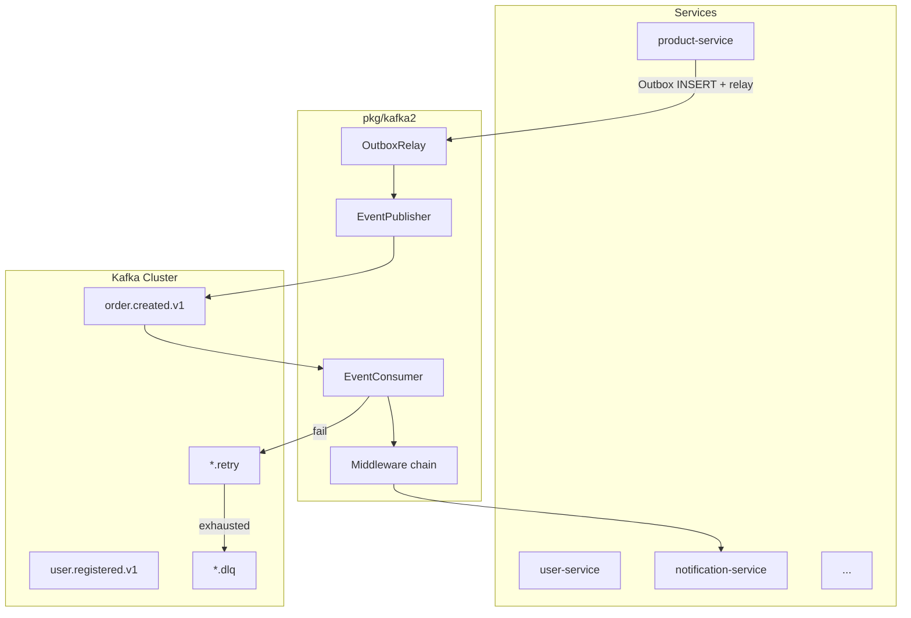

# Đề xuất: `pkg/kafka2` — Kafka cho EDA scale lớn

> Phiên bản: 1.0  
> Phạm vi: Hạ tầng messaging dùng chung cho toàn bộ microservices (`product`, `user`, `notification`, `promotion`, `recommend`, `social`, `logicstic`)

---

## 1. Mục tiêu

Xây dựng lớp Kafka mới thay thế dần `pkg/kafka`, đáp ứng:

| Mục tiêu | Mô tả |
|----------|-------|
| **Throughput cao** | Batch produce, compression, partition parallelism, worker pool consume |
| **EDA chuẩn** | Event envelope thống nhất, topic naming convention, schema versioning |
| **Độ tin cậy** | At-least-once + idempotent consumer, Outbox pattern, DLQ |
| **Scale ngang** | Consumer group per service, cooperative rebalance, key-based ordering |
| **Vận hành** | Metrics, structured logging, graceful shutdown, config per service |

---

## 2. Vấn đề của `pkg/kafka` hiện tại

| # | Vấn đề | Tác động |
|---|--------|----------|
| 1 | Consumer xử lý tuần tự, commit kể cả khi handler lỗi | Mất message / duplicate không kiểm soát |
| 2 | `Publish` async không báo delivery failure cho caller | Mất event im lặng ở scale lớn |
| 3 | `Producer.Close()` đệ quy vô hạn | Crash khi shutdown |
| 4 | Config YAML lệch struct Go | Tuning không có hiệu lực |
| 5 | Không có event envelope, DLQ, outbox, idempotency | Không đủ cho EDA production |
| 6 | Một `KafkaConfig` chung producer + consumer | Không phù hợp microservice (mỗi service 1 group.id) |
| 7 | `middleware.go`, `topic.go` rỗng | Không có convention |

`pkg/kafka2` giữ lại những gì đúng (Confluent client, manual commit, batching) và bổ sung toàn bộ building blocks còn thiếu.

---

## 3. Kiến trúc tổng thể



### Luồng publish (critical events)

```
HTTP/gRPC handler
  → BEGIN TX
  → UPDATE business state
  → INSERT outbox_events (status=pending)
  → COMMIT TX
  → OutboxRelay poll → EventPublisher.Publish → Kafka
```

### Luồng consume

```
Poll loop (1 goroutine)
  → dispatch to partition worker (giữ ordering per partition)
  → Middleware: trace → dedupe → handler → metrics
  → success: CommitMessage
  → retryable error: publish to retry topic (delay header)
  → fatal / max retries: publish to DLQ
```

---

## 4. Cấu trúc package

```
pkg/kafka2/
├── PROPOSAL.md          # Tài liệu này
├── config.go            # Config độc lập, typed, có default production-ready
├── event.go             # Event envelope, headers chuẩn
├── topic.go             # Topic naming, builder, partition key helper
├── producer.go          # EventPublisher — async batch + sync + flush
├── consumer.go          # EventConsumer — poll loop + worker pool
├── middleware.go        # Chain: logging, tracing, metrics, idempotency
├── retry.go             # Retry policy + retry topic routing
├── dlq.go               # Dead letter queue publisher
├── outbox.go            # Outbox store interface + relay worker
├── idempotency.go       # Dedupe store interface (Redis/Postgres)
├── metrics.go           # Prometheus hooks
└── errors.go            # Typed errors: Retryable, Fatal, Skip
```

---

## 5. Event Envelope

Mọi message trên Kafka **bắt buộc** dùng envelope chuẩn. Payload nghiệp vụ nằm trong `data`.

```json
{
  "event_id": "550e8400-e29b-41d4-a716-446655440000",
  "event_type": "order.created",
  "event_version": "v1",
  "source": "product-service",
  "occurred_at": "2026-06-05T10:00:00Z",
  "correlation_id": "req-abc-123",
  "causation_id": "evt-parent-456",
  "data": { "...": "business payload" }
}
```

### Kafka headers (bắt buộc)

| Header | Mô tả |
|--------|-------|
| `x-event-id` | UUID — dedupe key |
| `x-event-type` | `order.created` |
| `x-event-version` | `v1` |
| `x-source` | Service name |
| `x-correlation-id` | Trace request xuyên service |
| `x-content-type` | `application/json` (mặc định) |

### Partition key

```
partition_key = aggregate_id   // order_id, user_id, shop_id
```

Cùng aggregate → cùng partition → **ordering guarantee** trong partition.

---

## 6. Topic Naming Convention

```
{domain}.{event}.{version}

Ví dụ:
  order.created.v1
  order.paid.v1
  user.registered.v1
  notification.sent.v1

Retry / DLQ:
  order.created.v1.retry
  order.created.v1.dlq
```

### Quy tắc tạo topic

| Thuộc tính | Khuyến nghị | Ghi chú |
|------------|-------------|---------|
| Partitions | Bắt đầu 12–24, scale theo throughput | ≈ số consumer instance tối đa trong 1 group |
| Replication | 3 (production) | `min.insync.replicas=2` |
| Retention | Domain events: 7–30 ngày | Audit: 90+ ngày hoặc compacted topic |
| Compression | `lz4` hoặc `zstd` | Producer bật sẵn |
| `cleanup.policy` | `delete` (event stream) / `compact` (changelog) | Tùy use case |

---

## 7. Producer (`EventPublisher`)

### Interface

```go
type EventPublisher interface {
    Publish(ctx context.Context, event *Event) error          // async, enqueue
    PublishSync(ctx context.Context, event *Event) error        // chờ delivery ack
    PublishBatch(ctx context.Context, events []*Event) error  // batch hiệu suất cao
    Flush(timeout time.Duration) int                          // drain trước shutdown
    Close() error
}
```

### Thiết kế hiệu suất cao

- **Idempotent producer**: `enable.idempotence=true`, `acks=all`, `max.in.flight.requests.per.connection=5`
- **Batching**: `linger.ms=20`, `batch.size=65536`, `compression.type=lz4`
- **Delivery reports**: goroutine riêng log/metrics mọi failure — không im lặng
- **Partition key**: tự động từ `event.AggregateID()` → hash vào partition
- **Không block handler**: service dùng Outbox; `Publish` chỉ enqueue vào librdkafka buffer

### Khi nào dùng `PublishSync`

- Outbox relay (cần biết delivery để mark `published`)
- Event critical ít volume (payment confirmed)
- **Không** dùng trong HTTP handler trực tiếp

---

## 8. Consumer (`EventConsumer`)

### Interface

```go
type Handler func(ctx context.Context, event *Event) error

type EventConsumer interface {
    Subscribe(ctx context.Context, topics []string, handler Handler) error
    Close(ctx context.Context) error
}
```

### Worker pool — giữ ordering

```
┌─────────────────────────────────────────┐
│  Poll goroutine (duy nhất)              │
│  Poll() → route by partition            │
└──────────┬──────────────────────────────┘
           │
     ┌─────┴─────┐
     ▼           ▼
  Worker[0]   Worker[N]    ← 1 worker / partition đang assign
  (part 0)    (part 3)
     │           │
     ▼           ▼
  middleware → handler → commit
```

- **1 poll goroutine** — yêu cầu của confluent-kafka-go
- **N worker goroutines** — mỗi partition tối đa 1 worker active → ordering preserved
- **`max.poll.interval.ms`** phải > thời gian xử lý message chậm nhất

### Commit strategy

| Kết quả handler | Hành động |
|-----------------|-----------|
| `nil` | `CommitMessage` |
| `ErrRetryable` | Publish retry topic, **không** commit (hoặc commit nếu dùng retry-as-new-message) |
| `ErrSkip` | Commit (poison message đã xử lý) |
| `ErrFatal` | Publish DLQ + commit |

### Rebalance

- Dùng `partition.assignment.strategy=cooperative-sticky`
- Implement `RebalanceCallback` để pause/resume partition workers an toàn

### Graceful shutdown

```
ctx cancel
  → stop poll loop
  → wait workers drain in-flight messages
  → final commit
  → close consumer
```

---

## 9. Middleware Chain

```go
consumer.Use(
    middleware.Recovery(),           // panic → DLQ
    middleware.Tracing(),            // extract/inject correlation_id
    middleware.Logging(logger),
    middleware.Metrics(registry),
    middleware.Idempotency(store),   // skip nếu event_id đã xử lý
    middleware.Retry(policy),        // classify error → retry/DLQ
)
```

Thứ tự: **Tracing → Idempotency → Handler → Metrics/Logging**

---

## 10. Reliability Patterns

### 10.1 Outbox Pattern (bắt buộc cho critical events)

```sql
CREATE TABLE outbox_events (
    id          UUID PRIMARY KEY,
    aggregate_id TEXT NOT NULL,
    event_type  TEXT NOT NULL,
    payload     JSONB NOT NULL,
    status      TEXT NOT NULL DEFAULT 'pending',  -- pending | published | failed
    created_at  TIMESTAMPTZ NOT NULL DEFAULT now(),
    published_at TIMESTAMPTZ
);
CREATE INDEX idx_outbox_pending ON outbox_events (status, created_at)
    WHERE status = 'pending';
```

`OutboxRelay` chạy background: poll `pending` → `PublishSync` → mark `published`.

### 10.2 Idempotent Consumer

```
Key dedupe: event_id
Store: Redis SET với TTL 7 ngày, hoặc Postgres processed_events
```

At-least-once delivery + idempotent handler = **effective exactly-once processing**.

### 10.3 Retry + DLQ

```
Retry policy:
  max_attempts: 5
  backoff: exponential (1s, 2s, 4s, 8s, 16s)
  retry_topic: {original}.retry

DLQ:
  topic: {original}.dlq
  headers: x-original-topic, x-error, x-retry-count, x-failed-at
```

---

## 11. Config per Service

Mỗi microservice có file config riêng, **không** dùng chung `group.id`:

```yaml
# services/notification/config/kafka.yaml
kafka:
  service_name: notification-service

  producer:
    bootstrap_servers: "broker1:9092,broker2:9092,broker3:9092"
    client_id: notification-service-producer
    acks: all
    linger_ms: 20
    batch_size: 65536
    compression_type: lz4
    delivery_timeout_ms: 120000

  consumer:
    bootstrap_servers: "broker1:9092,broker2:9092,broker3:9092"
    group_id: notification-service          # ← unique per service
    auto_offset_reset: earliest
    enable_auto_commit: false
    session_timeout_ms: 45000
    heartbeat_interval_ms: 15000
    max_poll_interval_ms: 300000
    poll_timeout_ms: 100
    partition_assignment_strategy: cooperative-sticky
    worker_buffer_size: 256

  retry:
    max_attempts: 5
    initial_backoff_ms: 1000
    max_backoff_ms: 60000

  outbox:
    enabled: true
    poll_interval_ms: 500
    batch_size: 100

  idempotency:
    enabled: true
    store: redis                          # redis | postgres
    ttl: 168h

  security:
    security_protocol: SASL_SSL
    sasl_mechanism: SCRAM-SHA-512
    sasl_user: "${KAFKA_USER}"
    sasl_password: "${KAFKA_PASSWORD}"
```

`config.go` trong `kafka2` có hàm `DefaultConfig()` trả về giá trị production-ready, service chỉ override phần cần thiết.

---

## 12. Observability

### Metrics (Prometheus)

| Metric | Type | Labels |
|--------|------|--------|
| `kafka_produce_total` | Counter | topic, event_type, status |
| `kafka_produce_duration_seconds` | Histogram | topic |
| `kafka_consume_total` | Counter | topic, event_type, status |
| `kafka_consume_duration_seconds` | Histogram | topic, event_type |
| `kafka_consumer_lag` | Gauge | topic, partition, group_id |
| `kafka_dlq_total` | Counter | topic, event_type |
| `kafka_retry_total` | Counter | topic |

### Logging

- Structured (`zap`): `event_id`, `event_type`, `correlation_id`, `partition`, `offset`, `latency_ms`
- **Không** log full payload ở production (PII); log `aggregate_id` + `event_type`

### Tracing

- Propagate `correlation_id` qua headers
- Tích hợp OpenTelemetry span per consume/produce

---

## 13. Tích hợp vào Service

### Ví dụ: `notification-service` consume `order.created.v1`

```go
func main() {
    cfg := kafka2.LoadConfig("config/kafka.yaml")
    log := zap.NewProduction()

    publisher, _ := kafka2.NewPublisher(cfg, log)
    defer publisher.Close()

    store := redis.NewIdempotencyStore(redisClient, cfg.Idempotency.TTL)
    consumer, _ := kafka2.NewConsumer(cfg, log)
    consumer.Use(
        middleware.Tracing(),
        middleware.Idempotency(store),
        middleware.Retry(cfg.Retry),
        middleware.Metrics(metricsRegistry),
    )

    ctx, cancel := signal.NotifyContext(context.Background(), syscall.SIGINT, syscall.SIGTERM)
    defer cancel()

    go consumer.Subscribe(ctx, []string{"order.created.v1"}, handleOrderCreated)

    <-ctx.Done()
}

func handleOrderCreated(ctx context.Context, e *kafka2.Event) error {
    var order OrderCreatedData
    if err := e.UnmarshalData(&order); err != nil {
        return kafka2.ErrSkip // poison message
    }
    return notificationService.SendOrderConfirmation(ctx, order)
}
```

### Ví dụ: `product-service` publish qua Outbox

```go
func (s *OrderService) CreateOrder(ctx context.Context, req CreateOrderReq) error {
    return s.db.WithTx(ctx, func(tx Tx) error {
        order := tx.InsertOrder(req)

        return s.outbox.Insert(ctx, tx, &kafka2.Event{
            EventType:   "order.created",
            EventVersion: "v1",
            Source:      "product-service",
            AggregateID: order.ID,
            Data:        order.ToEventData(),
        })
    })
    // OutboxRelay background sẽ publish lên order.created.v1
}
```

---

## 14. Ma trận Event (khởi đầu)

| Event | Producer | Consumers | Partition Key |
|-------|----------|-----------|---------------|
| `order.created.v1` | product | notification, recommend, logicstic | `order_id` |
| `order.paid.v1` | product | notification, logicstic | `order_id` |
| `user.registered.v1` | user | notification, recommend | `user_id` |
| `product.updated.v1` | product | recommend, search-indexer | `product_id` |
| `voucher.applied.v1` | promotion | product, notification | `order_id` |
| `chat.message.sent.v1` | social | notification | `conversation_id` |

---

## 15. Lộ trình triển khai

### Phase 1 — Core (1–2 tuần)

- [ ] `config.go` + defaults
- [ ] `event.go` envelope encode/decode
- [ ] `producer.go` — fix toàn bộ bug từ `pkg/kafka`
- [ ] `consumer.go` — poll loop + worker pool + graceful shutdown
- [ ] `errors.go` — `ErrRetryable`, `ErrFatal`, `ErrSkip`
- [ ] Unit test với mock broker / testcontainers

### Phase 2 — Reliability (1 tuần)

- [ ] `middleware.go` — chain
- [ ] `idempotency.go` — Redis store
- [ ] `retry.go` + `dlq.go`
- [ ] `outbox.go` — interface + relay worker

### Phase 3 — Production (1 tuần)

- [ ] `metrics.go` — Prometheus
- [ ] `topic.go` — builder + validation
- [ ] Tích hợp `notification-service` (consumer đầu tiên)
- [ ] Tích hợp `product-service` (outbox producer đầu tiên)
- [ ] Load test: target ≥ 50k events/s cluster, ≥ 5k events/s per service

### Phase 4 — Nâng cao

- [ ] Schema Registry (Avro/Protobuf) khi số lượng event types > 30
- [ ] Kafka Connect cho CDC (Postgres → Kafka)
- [ ] Multi-region replication (MirrorMaker 2)

---

## 16. Tiêu chí chấp nhận

| Tiêu chí | Ngưỡng |
|----------|--------|
| Produce latency p99 | < 50ms (async enqueue) |
| End-to-end latency p99 | < 500ms (publish → consume → handler) |
| Consumer lag under load | < 1000 messages steady state |
| Zero message loss | Outbox + acks=all + manual commit |
| Duplicate processing | < 0.01% với idempotency enabled |
| Graceful shutdown | Không mất in-flight message đã xử lý |
| DLQ coverage | 100% unrecoverable errors có trong DLQ |

---

## 17. Quyết định kiến trúc (ADR tóm tắt)

| Quyết định | Lựa chọn | Lý do |
|------------|----------|-------|
| Kafka client | `confluent-kafka-go v2` | librdkafka C, throughput cao nhất trong Go ecosystem |
| Serialization | JSON envelope + version field | Đơn giản, đủ cho giai đoạn đầu; migrate Avro sau |
| Delivery guarantee | At-least-once + idempotent consumer | Cân bằng độ tin cậy / độ phức tạp |
| Critical publish | Outbox pattern | Tránh dual-write problem |
| Consumer concurrency | 1 worker / partition | Giữ ordering, scale bằng partition count |
| Config | Per-service YAML | Mỗi service 1 group.id, 1 client.id |

---

## 18. Migration từ `pkg/kafka`

1. Giữ `pkg/kafka` không đổi — không break existing code
2. Service mới tích hợp chỉ dùng `pkg/kafka2`
3. Khi `kafka2` stable (Phase 3 xong) → deprecate `pkg/kafka`
4. Mapping API:

| `pkg/kafka` | `pkg/kafka2` |
|-------------|--------------|
| `Producer.Publish` | `EventPublisher.Publish` |
| `Producer.PublishSync` | `EventPublisher.PublishSync` |
| `Consumer.Subscribe` | `EventConsumer.Subscribe` + middleware |
| `SendMessage` | `Event` (envelope) |
| `ReceiveMessage` | `Event` (envelope) |
